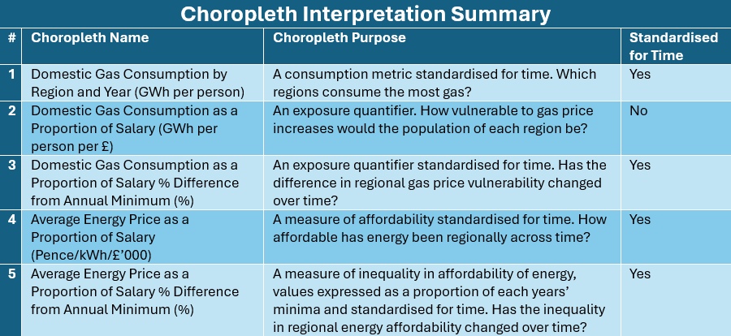

# The Cost-of-Living Crisis, the Russian Invasion and What can be Done to Help – A Data Science Project


(Signify, 2023)

‌
## Introduction

In 2021 the United Kingdom started to see an increase in the cost of day-to-day essentials. This phenomenon has been dubbed ‘the cost-of-living crisis’. One of the most shocking increases in price was seen in the energy market. This disproportionately affected working class families, leading to an estimated 14.3 million individuals, including 4.3 million children, to be living in poverty in the UK in 2022‌ (Francis-Devine, 2024).

At the start of 2022 Russia invaded Ukraine. Many headlines at the time linked the conflict to rising energy prices in the UK, claiming the severing of our Russian gas imports led to heightened fuel import costs.


Borrett (2022), Jones (2022), Clark (2022), News (2022).

## Data Science Project Goals

In this project a hypothesis will be addressed, and further analysis will be carried out to give speculative insight into how future policy may affect the cost of living.

### Hypothesis

The hypothesis investigated in the first half of this project is:

“The Russian invasion of Ukraine caused an increase in the cost of energy bills in England.”

### Future Policy

The effects of a change of pricing policy from marginal to regional will be investigated. Further explanation on the differences between these two policies will be given in the second half of this project.

## Data Collection and Cleaning

Multiple datasets were leveraged to gain insight into this research question. Timeseries data was combined to observe the relationship between the average unit cost of energy, the import price of fuel and the average salary. Regional data was combined to observe geographic trends in fuel use, average unit cost of energy, and average salary.

Pandas was used to import, clean and manipulate data; SKLearn was used to fit linear regressions and to extrapolate values; Plotly and Seaborn were used to bring the data to life by creating visuals.
```python
import os
import pandas as pd
import matplotlib.pyplot as plt
import plotly.express as px
import numpy as np
import json
import seaborn as sns
import warnings
from urllib.request import urlopen
from plotly import graph_objects as go
from sklearn import datasets
from sklearn.linear_model import LinearRegression
from dotenv import load_dotenv
```

To limit scope, only data for England was analysed as part of this project.

Please see the pdf available in this repository to better view the full data pipeline.


*See pdf for better detail*

### The Datasets
**\[1\] Subnational total final energy consumption, UK, 2005 to 2022** - Department of Energy Security and Net Zero - [_https://view.officeapps.live.com/op/view.aspx?src=https%3A%2F%2Fassets.publishing.service.gov.uk%2Fmedia%2F66f2c25686ba7c46c40c6eae%2FSubnational_total_final_consumption_2005_2022.xlsx&wdOrigin=BROWSELINK_](https://view.officeapps.live.com/op/view.aspx?src=https%3A%2F%2Fassets.publishing.service.gov.uk%2Fmedia%2F66f2c25686ba7c46c40c6eae%2FSubnational_total_final_consumption_2005_2022.xlsx&wdOrigin=BROWSELINK)

**\[2\] Subnational gas consumption, Great Britain, 2005 – 2022** \- Department of Energy Security and Net Zero - _<https://view.officeapps.live.com/op/view.aspx?src=https%3A%2F%2Fassets.publishing.service.gov.uk%2Fmedia%2F65b02faf1702b1000dcb111a%2FSubnational_gas_consumption_statistics_2005-2022.xlsx&wdOrigin=BROWSELINK>_

**\[3\] Estimates of the population for the UK, England, Wales, Scotland, and Northern Ireland 2011 to 2022** – Office of National Statistics - [_https://www.ons.gov.uk/peoplepopulationandcommunity/populationandmigration/populationestimates/datasets/populationestimatesforukenglandandwalesscotlandandnorthernireland_](https://www.ons.gov.uk/peoplepopulationandcommunity/populationandmigration/populationestimates/datasets/populationestimatesforukenglandandwalesscotlandandnorthernireland)

**\[4\] Local Authority District to Region (April 2020) Lookup in EN -** Office of National Statistics - [_https://geoportal.statistics.gov.uk/datasets/ons::local-authority-district-to-region-april-2020-lookup-in-en/explore_](https://geoportal.statistics.gov.uk/datasets/ons::local-authority-district-to-region-april-2020-lookup-in-en/explore)

**\[5\] Average annual domestic standard electricity bills and unit costs for regions in the United Kingdom** – Department of Energy Security and Net Zero - _<https://view.officeapps.live.com/op/view.aspx?src=https%3A%2F%2Fassets.publishing.service.gov.uk%2Fmedia%2F667c0b71aec8650b1009006d%2Ftable_223.xlsx&wdOrigin=BROWSELINK>_

**\[6\] Average prices of fuels purchased by the major UK power producers 1990 - 2023** - Department of Energy Security and Net Zero - _<https://view.officeapps.live.com/op/view.aspx?src=https%3A%2F%2Fassets.publishing.service.gov.uk%2Fmedia%2F66f3d0e19d78f6f2d75bf81a%2Ftable_321.xlsx&wdOrigin=BROWSELINK>_

**\[7\] Average earnings by age and region 2002 – 2024** – House of Commons Library - [_https://commonslibrary.parliament.uk/research-briefings/cbp-8456/_](https://commonslibrary.parliament.uk/research-briefings/cbp-8456/)

**\[8\] Geo-JSON of UK Regions** _-_ [_https://raw.githubusercontent.com/martinjc/UK-GeoJSON/refs/heads/master/json/eurostat/ew/nuts1.json_](https://raw.githubusercontent.com/martinjc/UK-GeoJSON/refs/heads/master/json/eurostat/ew/nuts1.json)

**\[9\] Area of each of the regions of England -** Wikipedia - <https://en.wikipedia.org/wiki/Regions_of_England>

_\-Please note dataset \[9\] was used in the code but the data was not in the end used for analysis-_

### Standardising the Regional Naming Conventions

#### Converting Local Authority Districts to Region Names

To be able to plot the regional data onto choropleths it was necessary to ensure that the regional naming convention for all data match that of the Geo-JSON. The chosen Geo-JSON (dataset \[8\]) used 3 letter location codes, which can be mapped from RGN20NM (regional codes), whereas the population dataset (dataset \[3\]) used LAD20CD (Local authority district code).

A conversion table was used (dataset \[4\]) to join the corresponding LAD20CD values onto the population dataset.
```python
#Source for Lookup table:
#https://geoportal.statistics.gov.uk/datasets/ons::local-authority-district-to-region-april-2020-lookup-in-en/explore
#In excel Find and replace was used to change all instances of 'East of England' to 'East'
LAD20_to_RGN20_Conversion_Table = pd.read_excel(io=Local_Authority_District_to_Region_4)
LAD20_to_RGN20_Conversion_Table
```

<table border="1" class="dataframe">
  <thead>
    <tr style="text-align: right;">
      <th></th>
      <th>LAD20CD</th>
      <th>LAD20NM</th>
      <th>RGN20CD</th>
      <th>RGN20NM</th>
      <th>FID</th>
    </tr>
  </thead>
  <tbody>
    <tr>
      <th>0</th>
      <td>E06000012</td>
      <td>North East Lincolnshire</td>
      <td>E12000003</td>
      <td>Yorkshire and The Humber</td>
      <td>1.0</td>
    </tr>
    <tr>
      <th>1</th>
      <td>E06000013</td>
      <td>North Lincolnshire</td>
      <td>E12000003</td>
      <td>Yorkshire and The Humber</td>
      <td>2.0</td>
    </tr>
    <tr>
      <th>2</th>
      <td>E06000014</td>
      <td>York</td>
      <td>E12000003</td>
      <td>Yorkshire and The Humber</td>
      <td>3.0</td>
    </tr>
    <tr>
      <th>3</th>
      <td>E07000163</td>
      <td>Craven</td>
      <td>E12000003</td>
      <td>Yorkshire and The Humber</td>
      <td>4.0</td>
    </tr>
    <tr>
      <th>4</th>
      <td>E07000164</td>
      <td>Hambleton</td>
      <td>E12000003</td>
      <td>Yorkshire and The Humber</td>
      <td>5.0</td>
    </tr>
    <tr>
      <th>...</th>
      <td>...</td>
      <td>...</td>
      <td>...</td>
      <td>...</td>
      <td>...</td>
    </tr>
    <tr>
      <th>315</th>
      <td>E06000062</td>
      <td>NaN</td>
      <td>NaN</td>
      <td>South East</td>
      <td>NaN</td>
    </tr>
    <tr>
      <th>316</th>
      <td>E06000063</td>
      <td>NaN</td>
      <td>NaN</td>
      <td>South East</td>
      <td>NaN</td>
    </tr>
    <tr>
      <th>317</th>
      <td>E06000064</td>
      <td>NaN</td>
      <td>NaN</td>
      <td>South East</td>
      <td>NaN</td>
    </tr>
    <tr>
      <th>318</th>
      <td>E06000065</td>
      <td>NaN</td>
      <td>NaN</td>
      <td>South East</td>
      <td>NaN</td>
    </tr>
    <tr>
      <th>319</th>
      <td>E06000066</td>
      <td>NaN</td>
      <td>NaN</td>
      <td>South East</td>
      <td>NaN</td>
    </tr>
  </tbody>
</table>
<p>320 rows × 5 columns</p>
</div>


Panda’s _.isna_ function was used to check for any failed matches. Some results were returned. To rectify this the missing values were added to the conversion table and the code reran.
```python
#Join the RGN20NM onto the UK_Population_Density_Raw_Data table
UK_Population_Raw_Data_With_Region = pd.merge(UK_Population_Raw_Data, LAD20_to_RGN20_Conversion_Table, left_on='ladcode23', right_on='LAD20CD', how='left')

#This checks if all rows relating to england have had a RGN20NM successfully allocated
len(UK_Population_Raw_Data_With_Region[UK_Population_Raw_Data_With_Region['RGN20NM'].notna()]) - len(UK_Population_Raw_Data_With_Region[UK_Population_Raw_Data_With_Region['country'] == 'E'])

#This initially returned a difference of 1092
#After manual adjustments this turned to 0
```


    0


#### Accounting for varying regional structures in data

The sub national gas consumption dataset \[2\] captured data at different granularity and with different naming conventions depending on the year. Some years London was grouped as a single row, others it was split over two as Inner London and Outer London, and some had 3 rows - London, Inner London and Outer London.

In the first case no cleaning was needed, and data was imported directly. In the second case both rows where imported. In the third case, only the row with a sum value for London was imported.

```python
#For this datasource not all the sheets have the same format, so the read_excel function must be adjusted for each.

#Defining the sheet names to read from the excel
Years1 = [str(n) for n in list(range(2005,2014))]
Gas_Consumption1 = pd.concat(((pd.read_excel(io=Sub_National_Gas_Consumption_2, sheet_name=Year, header=5, nrows=9, skiprows=[6,7]).assign(Year = Year))for Year in Years1), ignore_index=True)

#In this one Inner and outerlondon are differinciated
Years2 = [str(n) for n in list(range(2014,2015))]
Gas_Consumption2 = pd.concat(((pd.read_excel(io=Sub_National_Gas_Consumption_2, sheet_name=Year, header=5, nrows=10, skiprows=[6,7]).assign(Year = Year))for Year in Years2), ignore_index=True)

#Removing the sub regions of Inner and outer London as as sum of these 'London is already included' this is to avoid double counting
Years3 = [str(n) for n in list(range(2015,2023))]
Gas_Consumption3 = pd.concat(((pd.read_excel(io=Sub_National_Gas_Consumption_2, sheet_name=Year, header=5, nrows=11, skiprows=[6,7,8,16,17]).assign(Year = Year))for Year in Years3), ignore_index=True)


#Combined data from all sheets into one dataframe
Gas_Consumption = pd.concat([Gas_Consumption1, Gas_Consumption2, Gas_Consumption3])

```


To enable the creation of choropleths it is needed to allocate a 3-letter location code to each region. This is done by completing a join using the Location_Code mapping table. This was created manually by refering to the location codes from the Geo-JSON, and the regional names from the Gas_Consumption table.

This mapping table also allowed inconsistencies in the naming of regions found in the data to be cleaned. Mapping both ‘Inner London’ and ‘Outer London’ as ‘London’; and mapping inconsistencies such as 'Yorkshire and the Humber' to 'Yorkshire and The Humber'.
```python
#Importing the GeoJSON
with urlopen('https://raw.githubusercontent.com/martinjc/UK-GeoJSON/refs/heads/master/json/eurostat/ew/nuts1.json') as response:
    Regions = json.load(response)
    
```
```python
#Printing a list of all Regions in the GeoJSON along with their Location Code
for ref in range(len(Regions['features'])):
    print(f"{Regions['features'][ref]['properties']['NUTS112CD']} / {Regions['features'][ref]['properties']['NUTS112NM']}")
```

    UKC / North East (England)
    UKD / North West (England)
    UKE / Yorkshire and The Humber
    UKF / East Midlands (England)
    UKG / West Midlands (England)
    UKH / East of England
    UKI / London
    UKJ / South East (England)
    UKK / South West (England
    UKL / Wales
    


```python
#Printing a list of all the Location Codes in the Gas_Consumption dataframe
Gas_Consumption['Country or region'].unique()
```


    array(['North East', 'North West', 'Yorkshire and The Humber',
           'East Midlands', 'West Midlands', 'East', 'London', 'South East',
           'South West', 'Yorkshire and the Humber', 'Inner London',
           'Outer London'], dtype=object)


```python
#Defining the Location_Code mapping table
Location_Code_List = [
    ('UKC', 'North East', 'North East'),
    ('UKD', 'North West', 'North West'),
    ('UKE', 'Yorkshire and The Humber', 'Yorkshire and The Humber'),
    ('UKE', 'Yorkshire and the Humber', 'Yorkshire and The Humber'),
    ('UKF', 'East Midlands', 'East Midlands'),
    ('UKG', 'West Midlands', 'West Midlands'),
    ('UKH', 'East', 'East'),
    ('UKI', 'Inner London', 'London'),
    ('UKI', 'Outer London', 'London'),
    ('UKI', 'London', 'London'),
    ('UKJ', 'South East', 'South East'),
    ('UKK', 'South West', 'South West')
]

Location_Code = pd.DataFrame(Location_Code_List, columns=['Location_Code', 'In_Region', 'Region'])
Location_Code
```


<table border="1" class="dataframe">
  <thead>
    <tr style="text-align: right;">
      <th></th>
      <th>Location_Code</th>
      <th>In_Region</th>
      <th>Region</th>
    </tr>
  </thead>
  <tbody>
    <tr>
      <th>0</th>
      <td>UKC</td>
      <td>North East</td>
      <td>North East</td>
    </tr>
    <tr>
      <th>1</th>
      <td>UKD</td>
      <td>North West</td>
      <td>North West</td>
    </tr>
    <tr>
      <th>2</th>
      <td>UKE</td>
      <td>Yorkshire and The Humber</td>
      <td>Yorkshire and The Humber</td>
    </tr>
    <tr>
      <th>3</th>
      <td>UKE</td>
      <td>Yorkshire and the Humber</td>
      <td>Yorkshire and The Humber</td>
    </tr>
    <tr>
      <th>4</th>
      <td>UKF</td>
      <td>East Midlands</td>
      <td>East Midlands</td>
    </tr>
    <tr>
      <th>5</th>
      <td>UKG</td>
      <td>West Midlands</td>
      <td>West Midlands</td>
    </tr>
    <tr>
      <th>6</th>
      <td>UKH</td>
      <td>East</td>
      <td>East</td>
    </tr>
    <tr>
      <th>7</th>
      <td>UKI</td>
      <td>Inner London</td>
      <td>London</td>
    </tr>
    <tr>
      <th>8</th>
      <td>UKI</td>
      <td>Outer London</td>
      <td>London</td>
    </tr>
    <tr>
      <th>9</th>
      <td>UKI</td>
      <td>London</td>
      <td>London</td>
    </tr>
    <tr>
      <th>10</th>
      <td>UKJ</td>
      <td>South East</td>
      <td>South East</td>
    </tr>
    <tr>
      <th>11</th>
      <td>UKK</td>
      <td>South West</td>
      <td>South West</td>
    </tr>
  </tbody>
</table>
</div>

The Location_Code table was joined to bring through the desired location codes and clean region names. A groupby was then performed to sum where a region's values had been split over multiple rows, e.g. 'Inner London' and 'Outer London'.

```python
#This step reclassifies regions into the desired regions found in the Geo-JSON
Gas_Consumption_Cleaned = Gas_Consumption.merge(Location_Code, right_on='In_Region', left_on='Country or region', how='left')

#This step combines values for Outer and inner london, which have both been classified as London
Gas_Consumption_Cleaned = Gas_Consumption_Cleaned.groupby(['Year','Location_Code'],as_index=False).agg({
    'Region': 'max',
    'Number of meters\n(thousands):\nDomestic\n' : 'sum',
     'Number of meters\n(thousands):\nNon-Domestic': 'sum',
     'Number of meters\n(thousands):\nAll meters': 'sum',
     'Total consumption\n(GWh):\nDomestic\n': 'sum',
     'Total consumption\n(GWh):\nNon-Domestic': 'sum',
     'Total consumption\n(GWh):\nAll meters': 'sum',
     'Mean consumption\n(kWh per meter):\nDomestic\n': 'sum',
     'Mean consumption\n(kWh per meter):\nNon-Domestic': 'sum',
     'Mean consumption\n(kWh per meter):\nAll meters' : 'sum'
})
Gas_Consumption_Cleaned
```


<table border="1" class="dataframe">
  <thead>
    <tr style="text-align: right;">
      <th></th>
      <th>Year</th>
      <th>Location_Code</th>
      <th>Region</th>
      <th>Number of meters\n(thousands):\nDomestic\n</th>
      <th>Number of meters\n(thousands):\nNon-Domestic</th>
      <th>Number of meters\n(thousands):\nAll meters</th>
      <th>Total consumption\n(GWh):\nDomestic\n</th>
      <th>Total consumption\n(GWh):\nNon-Domestic</th>
      <th>Total consumption\n(GWh):\nAll meters</th>
      <th>Mean consumption\n(kWh per meter):\nDomestic\n</th>
      <th>Mean consumption\n(kWh per meter):\nNon-Domestic</th>
      <th>Mean consumption\n(kWh per meter):\nAll meters</th>
    </tr>
  </thead>
  <tbody>
    <tr>
      <th>0</th>
      <td>2005</td>
      <td>UKC</td>
      <td>North East</td>
      <td>1037.403</td>
      <td>16.219</td>
      <td>1053.622</td>
      <td>20710.658157</td>
      <td>13952.158200</td>
      <td>34662.816357</td>
      <td>19963.946660</td>
      <td>860235.415254</td>
      <td>32898.721132</td>
    </tr>
    <tr>
      <th>1</th>
      <td>2005</td>
      <td>UKD</td>
      <td>North West</td>
      <td>2747.967</td>
      <td>48.871</td>
      <td>2796.838</td>
      <td>53390.873953</td>
      <td>35926.287793</td>
      <td>89317.161746</td>
      <td>19429.226753</td>
      <td>735124.875550</td>
      <td>31935.050134</td>
    </tr>
    <tr>
      <th>2</th>
      <td>2005</td>
      <td>UKE</td>
      <td>Yorkshire and The Humber</td>
      <td>1989.970</td>
      <td>36.997</td>
      <td>2026.967</td>
      <td>39024.143235</td>
      <td>30648.965991</td>
      <td>69673.109226</td>
      <td>19610.417863</td>
      <td>828417.601184</td>
      <td>34373.085120</td>
    </tr>
    <tr>
      <th>3</th>
      <td>2005</td>
      <td>UKF</td>
      <td>East Midlands</td>
      <td>1620.786</td>
      <td>28.502</td>
      <td>1649.288</td>
      <td>31469.021304</td>
      <td>18936.399391</td>
      <td>50405.420695</td>
      <td>19415.901485</td>
      <td>664388.442601</td>
      <td>30561.927750</td>
    </tr>
    <tr>
      <th>4</th>
      <td>2005</td>
      <td>UKG</td>
      <td>West Midlands</td>
      <td>1984.918</td>
      <td>36.397</td>
      <td>2021.315</td>
      <td>37726.189511</td>
      <td>22962.792215</td>
      <td>60688.981726</td>
      <td>19006.422185</td>
      <td>630897.937055</td>
      <td>30024.504704</td>
    </tr>
    <tr>
      <th>...</th>
      <td>...</td>
      <td>...</td>
      <td>...</td>
      <td>...</td>
      <td>...</td>
      <td>...</td>
      <td>...</td>
      <td>...</td>
      <td>...</td>
      <td>...</td>
      <td>...</td>
      <td>...</td>
    </tr>
    <tr>
      <th>157</th>
      <td>2022</td>
      <td>UKG</td>
      <td>West Midlands</td>
      <td>2221.428</td>
      <td>21.914</td>
      <td>2243.342</td>
      <td>25247.105176</td>
      <td>15406.577700</td>
      <td>40653.682876</td>
      <td>11365.259273</td>
      <td>703047.262016</td>
      <td>18121.928300</td>
    </tr>
    <tr>
      <th>158</th>
      <td>2022</td>
      <td>UKH</td>
      <td>East</td>
      <td>2217.992</td>
      <td>20.366</td>
      <td>2238.358</td>
      <td>25143.154335</td>
      <td>13711.245874</td>
      <td>38854.400209</td>
      <td>11335.998658</td>
      <td>673241.965715</td>
      <td>17358.438734</td>
    </tr>
    <tr>
      <th>159</th>
      <td>2022</td>
      <td>UKI</td>
      <td>London</td>
      <td>3001.866</td>
      <td>39.524</td>
      <td>3041.390</td>
      <td>35792.967053</td>
      <td>19576.692142</td>
      <td>55369.659195</td>
      <td>11923.572555</td>
      <td>495311.510530</td>
      <td>18205.379512</td>
    </tr>
    <tr>
      <th>160</th>
      <td>2022</td>
      <td>UKJ</td>
      <td>South East</td>
      <td>3428.042</td>
      <td>35.662</td>
      <td>3463.704</td>
      <td>39604.299045</td>
      <td>16541.969255</td>
      <td>56146.268301</td>
      <td>11553.037870</td>
      <td>463854.221730</td>
      <td>16209.892156</td>
    </tr>
    <tr>
      <th>161</th>
      <td>2022</td>
      <td>UKK</td>
      <td>South West</td>
      <td>1994.866</td>
      <td>18.140</td>
      <td>2013.006</td>
      <td>19620.178140</td>
      <td>10846.932730</td>
      <td>30467.110870</td>
      <td>9835.336379</td>
      <td>597956.600307</td>
      <td>15135.131674</td>
    </tr>
  </tbody>
</table>
<p>162 rows × 12 columns</p>
</div>


The field \[Location Code\] was checked for NULL values to ensure all rows had been successfully allocated a Location_Code via the join.


```python
#Checking that all regions have been successfully allocated a Location_Code
Gas_Consumption_Cleaned[Gas_Consumption_Cleaned['Location_Code'].isnull()]
```


<table border="1" class="dataframe">
  <thead>
    <tr style="text-align: right;">
      <th></th>
      <th>Year</th>
      <th>Location_Code</th>
      <th>Region</th>
      <th>Number of meters\n(thousands):\nDomestic\n</th>
      <th>Number of meters\n(thousands):\nNon-Domestic</th>
      <th>Number of meters\n(thousands):\nAll meters</th>
      <th>Total consumption\n(GWh):\nDomestic\n</th>
      <th>Total consumption\n(GWh):\nNon-Domestic</th>
      <th>Total consumption\n(GWh):\nAll meters</th>
      <th>Mean consumption\n(kWh per meter):\nDomestic\n</th>
      <th>Mean consumption\n(kWh per meter):\nNon-Domestic</th>
      <th>Mean consumption\n(kWh per meter):\nAll meters</th>
    </tr>
  </thead>
  <tbody>
  </tbody>
</table>
</div>


#### Grouping Overly Granular Data

The domestic energy bills dataset \[5\] had an additional regional grouping of Southern.
```python
Energy_Price[Energy_Price['Year'] == 2000]
```


<table border="1" class="dataframe">
  <thead>
    <tr style="text-align: right;">
      <th></th>
      <th>Year</th>
      <th>Region</th>
      <th>Average Unit Cost (Pence per kWh)</th>
    </tr>
  </thead>
  <tbody>
    <tr>
      <th>63</th>
      <td>2000</td>
      <td>Northern Scotland</td>
      <td>8.25</td>
    </tr>
    <tr>
      <th>65</th>
      <td>2000</td>
      <td>Northern Ireland</td>
      <td>9.35</td>
    </tr>
    <tr>
      <th>67</th>
      <td>2000</td>
      <td>West Midlands</td>
      <td>7.44</td>
    </tr>
    <tr>
      <th>70</th>
      <td>2000</td>
      <td>South East</td>
      <td>7.38</td>
    </tr>
    <tr>
      <th>73</th>
      <td>2000</td>
      <td>South Wales</td>
      <td>8.64</td>
    </tr>
    <tr>
      <th>76</th>
      <td>2000</td>
      <td>Southern Scotland</td>
      <td>8.11</td>
    </tr>
    <tr>
      <th>79</th>
      <td>2000</td>
      <td>Eastern</td>
      <td>7.31</td>
    </tr>
    <tr>
      <th>82</th>
      <td>2000</td>
      <td>Yorkshire</td>
      <td>7.57</td>
    </tr>
    <tr>
      <th>85</th>
      <td>2000</td>
      <td>Merseyside &amp; North Wales</td>
      <td>8.21</td>
    </tr>
    <tr>
      <th>88</th>
      <td>2000</td>
      <td>London</td>
      <td>7.64</td>
    </tr>
    <tr>
      <th>91</th>
      <td>2000</td>
      <td>North West</td>
      <td>7.54</td>
    </tr>
    <tr>
      <th>94</th>
      <td>2000</td>
      <td>North East</td>
      <td>8.00</td>
    </tr>
    <tr>
      <th>97</th>
      <td>2000</td>
      <td>East Midlands</td>
      <td>7.26</td>
    </tr>
    <tr>
      <th>100</th>
      <td>2000</td>
      <td>South West</td>
      <td>8.22</td>
    </tr>
    <tr>
      <th>103</th>
      <td>2000</td>
      <td>Southern</td>
      <td>7.70</td>
    </tr>
  </tbody>
</table>
</div>
The Geo-JSON only had South East and South West regions so the Southern region had to be split. This was split done by averaging its value first with the South East and then with the South West and replaced the East and West values with the averaged ones. This method essentially assumes there is a linear relationship as you run through the values from East to West, allowing for interpolation. This method was selected as the differences in values between South West and Southern, and South East and Southern where small, ~7% from Southern either way.


This could be more appropriately split using a 3<sup>rd</sup> variable to calculate a weighted split based, for example, on population or regional area. This method was however chosen for simplicity and is acceptable as variance between the regions is small.
```python
#ChatGPT Generated code to replace 'South West' with the average of 'Southern' and 'South West'
# Group by Year to calculate averages
for year in Energy_Price['Year'].unique():
    # Filter the current year's data for 'Southern' and 'South West'
    southern_value = Energy_Price.loc[(Energy_Price['Year'] == year) & (Energy_Price['Region'] == 'Southern'), 'Average Unit Cost (Pence per kWh)'].values
    south_west_value = Energy_Price.loc[(Energy_Price['Year'] == year) & (Energy_Price['Region'] == 'South West'), 'Average Unit Cost (Pence per kWh)'].values

    if southern_value.size > 0 and south_west_value.size > 0:
        # Calculate the average
        avg_value = (southern_value[0] + south_west_value[0]) / 2

        # Update 'South West' value
        Energy_Price.loc[(Energy_Price['Year'] == year) & (Energy_Price['Region'] == 'South West'), 'Average Unit Cost (Pence per kWh)'] = avg_value
```


```python
#ChatGPT Generated code to replace 'South East' with the average of 'Southern' and 'South East'
# Group by Year to calculate averages
for year in Energy_Price['Year'].unique():
    # Filter the current year's data for 'Southern' and 'South East'
    southern_value = Energy_Price.loc[(Energy_Price['Year'] == year) & (Energy_Price['Region'] == 'Southern'), 'Average Unit Cost (Pence per kWh)'].values
    south_east_value = Energy_Price.loc[(Energy_Price['Year'] == year) & (Energy_Price['Region'] == 'South East'), 'Average Unit Cost (Pence per kWh)'].values

    if southern_value.size > 0 and south_east_value.size > 0:
        # Calculate the average
        avg_value = (southern_value[0] + south_east_value[0]) / 2

        # Update 'South East' value
        Energy_Price.loc[(Energy_Price['Year'] == year) & (Energy_Price['Region'] == 'South East'), 'Average Unit Cost (Pence per kWh)'] = avg_value
```
```python
Energy_Price = Energy_Price[Energy_Price['Region'] != 'Southern']
Energy_Price[Energy_Price['Year'] == 2000]
```

<table border="1" class="dataframe">
  <thead>
    <tr style="text-align: right;">
      <th></th>
      <th>Year</th>
      <th>Region</th>
      <th>Average Unit Cost (Pence per kWh)</th>
    </tr>
  </thead>
  <tbody>
    <tr>
      <th>63</th>
      <td>2000</td>
      <td>Northern Scotland</td>
      <td>8.25</td>
    </tr>
    <tr>
      <th>65</th>
      <td>2000</td>
      <td>Northern Ireland</td>
      <td>9.35</td>
    </tr>
    <tr>
      <th>67</th>
      <td>2000</td>
      <td>West Midlands</td>
      <td>7.44</td>
    </tr>
    <tr>
      <th>70</th>
      <td>2000</td>
      <td>South East</td>
      <td>7.54</td>
    </tr>
    <tr>
      <th>73</th>
      <td>2000</td>
      <td>South Wales</td>
      <td>8.64</td>
    </tr>
    <tr>
      <th>76</th>
      <td>2000</td>
      <td>Southern Scotland</td>
      <td>8.11</td>
    </tr>
    <tr>
      <th>79</th>
      <td>2000</td>
      <td>Eastern</td>
      <td>7.31</td>
    </tr>
    <tr>
      <th>82</th>
      <td>2000</td>
      <td>Yorkshire</td>
      <td>7.57</td>
    </tr>
    <tr>
      <th>85</th>
      <td>2000</td>
      <td>Merseyside &amp; North Wales</td>
      <td>8.21</td>
    </tr>
    <tr>
      <th>88</th>
      <td>2000</td>
      <td>London</td>
      <td>7.64</td>
    </tr>
    <tr>
      <th>91</th>
      <td>2000</td>
      <td>North West</td>
      <td>7.54</td>
    </tr>
    <tr>
      <th>94</th>
      <td>2000</td>
      <td>North East</td>
      <td>8.00</td>
    </tr>
    <tr>
      <th>97</th>
      <td>2000</td>
      <td>East Midlands</td>
      <td>7.26</td>
    </tr>
    <tr>
      <th>100</th>
      <td>2000</td>
      <td>South West</td>
      <td>7.96</td>
    </tr>
  </tbody>
</table>
</div>


### Extrapolation of Data

Dataset \[3\] was used to bring population for each region into the dataset. This source only covered values from the years 2011 to 2022, however, the other regional data covered 2005 to 2022.

Values had to be extrapolated for the years 2005 to 2010.


*Figure 1*

Firstly, the data was plotted to visually determine the data’s trend. The lines produced appear to be mostly straight suggesting a linear relationship between population and time (Accounting Insights, 2024). Although a few outliers can be determined, such as the reduction in population in London in 2020 and 2021, likely caused by the emigration of individuals out of major population centres which occurred in the Covid-19 pandemic (Centre for Cities, 2024). Even with this outlier, from the visual we can observe that the variance year to year is small; therefore, the error of extrapolated values is also likely to be small.

Secondly, Panda’s _.corr_ function was used to calculate Pearson’s correlation values between population (for each region) and year (See the right most column). Apart from London and the North East, all values were 0.98 or greater indicating a very strong linear correlation between population and year. The outliers in 2020 and 2021 in London have already been discussed; population values for the North East are significantly smaller (only 42% of the mean regional population for 2022) than values for other regions meaning smaller variations in trend cause proportionally higher impact to the p-value.

```python
Population_by_Region_and_Year_Pivot = Population_by_Region_and_Year.pivot(index = 'Year', columns= 'Region')
Population_by_Region_and_Year_Pivot['Year'] = Population_by_Region_and_Year_Pivot.index
Population_by_Region_and_Year_Pivot.corr()
```

<table border="1" class="dataframe">
  <thead>
    <tr>
      <th></th>
      <th></th>
      <th colspan="9" halign="left">Population</th>
      <th>Year</th>
    </tr>
    <tr>
      <th></th>
      <th>Region</th>
      <th>East</th>
      <th>East Midlands</th>
      <th>London</th>
      <th>North East</th>
      <th>North West</th>
      <th>South East</th>
      <th>South West</th>
      <th>West Midlands</th>
      <th>Yorkshire and The Humber</th>
      <th></th>
    </tr>
    <tr>
      <th></th>
      <th>Region</th>
      <th></th>
      <th></th>
      <th></th>
      <th></th>
      <th></th>
      <th></th>
      <th></th>
      <th></th>
      <th></th>
      <th></th>
    </tr>
  </thead>
  <tbody>
    <tr>
      <th rowspan="9" valign="top">Population</th>
      <th>East</th>
      <td>1.000000</td>
      <td>0.995639</td>
      <td>0.952173</td>
      <td>0.920096</td>
      <td>0.984919</td>
      <td>0.999387</td>
      <td>0.997129</td>
      <td>0.996699</td>
      <td>0.994990</td>
      <td>0.992994</td>
    </tr>
    <tr>
      <th>East Midlands</th>
      <td>0.995639</td>
      <td>1.000000</td>
      <td>0.936214</td>
      <td>0.937375</td>
      <td>0.994076</td>
      <td>0.996868</td>
      <td>0.998976</td>
      <td>0.999739</td>
      <td>0.997280</td>
      <td>0.995321</td>
    </tr>
    <tr>
      <th>London</th>
      <td>0.952173</td>
      <td>0.936214</td>
      <td>1.000000</td>
      <td>0.786523</td>
      <td>0.895828</td>
      <td>0.943988</td>
      <td>0.931793</td>
      <td>0.942203</td>
      <td>0.945407</td>
      <td>0.917723</td>
    </tr>
    <tr>
      <th>North East</th>
      <td>0.920096</td>
      <td>0.937375</td>
      <td>0.786523</td>
      <td>1.000000</td>
      <td>0.963696</td>
      <td>0.931897</td>
      <td>0.937396</td>
      <td>0.931297</td>
      <td>0.940663</td>
      <td>0.939365</td>
    </tr>
    <tr>
      <th>North West</th>
      <td>0.984919</td>
      <td>0.994076</td>
      <td>0.895828</td>
      <td>0.963696</td>
      <td>1.000000</td>
      <td>0.988930</td>
      <td>0.994409</td>
      <td>0.992083</td>
      <td>0.989665</td>
      <td>0.994604</td>
    </tr>
    <tr>
      <th>South East</th>
      <td>0.999387</td>
      <td>0.996868</td>
      <td>0.943988</td>
      <td>0.931897</td>
      <td>0.988930</td>
      <td>1.000000</td>
      <td>0.998226</td>
      <td>0.997300</td>
      <td>0.996488</td>
      <td>0.994499</td>
    </tr>
    <tr>
      <th>South West</th>
      <td>0.997129</td>
      <td>0.998976</td>
      <td>0.931793</td>
      <td>0.937396</td>
      <td>0.994409</td>
      <td>0.998226</td>
      <td>1.000000</td>
      <td>0.998837</td>
      <td>0.995347</td>
      <td>0.997157</td>
    </tr>
    <tr>
      <th>West Midlands</th>
      <td>0.996699</td>
      <td>0.999739</td>
      <td>0.942203</td>
      <td>0.931297</td>
      <td>0.992083</td>
      <td>0.997300</td>
      <td>0.998837</td>
      <td>1.000000</td>
      <td>0.997378</td>
      <td>0.994335</td>
    </tr>
    <tr>
      <th>Yorkshire and The Humber</th>
      <td>0.994990</td>
      <td>0.997280</td>
      <td>0.945407</td>
      <td>0.940663</td>
      <td>0.989665</td>
      <td>0.996488</td>
      <td>0.995347</td>
      <td>0.997378</td>
      <td>1.000000</td>
      <td>0.989635</td>
    </tr>
    <tr>
      <th>Year</th>
      <th></th>
      <td>0.992994</td>
      <td>0.995321</td>
      <td>0.917723</td>
      <td>0.939365</td>
      <td>0.994604</td>
      <td>0.994499</td>
      <td>0.997157</td>
      <td>0.994335</td>
      <td>0.989635</td>
      <td>1.000000</td>
    </tr>
  </tbody>
</table>
</div>

Values for 2005 to 2010 were extrapolated using a linear regression model fit to all years of data using Sklearn. When these values are plotted (Figure 2) there is an obvious mismatch across the years 2010 to 2011 where the extrapolated data meets the actual data, especially for London. This suggests the model has not been very successful in predicting datapoints outside the initial data range. This is likely due to the outliers created in the years 2020 to 2022 due to the Covid-19 pandemic.

.png)
*Figure 2*

```python
def extrapolate_population_for_region_v1(region):
    #Filtering to handle each region seperately
    Population_by_Region_and_Year_for_Extrapoloation = Population_by_Region_and_Year[Population_by_Region_and_Year['Region']==region]

    X = Population_by_Region_and_Year_for_Extrapoloation['Year'].values.reshape(-1,1)
    y = Population_by_Region_and_Year_for_Extrapoloation['Population']

    #Fitting the linear regession model
    Population_by_Region_and_Year_Model = LinearRegression()
    Population_by_Region_and_Year_Model.fit(X,y)
    
    #Extrapolating for the years where data is missing
    years_to_extrapolate = np.array([2005, 2006, 2007, 2008, 2009, 2010]).reshape(-1, 1)

    population_predictions = Population_by_Region_and_Year_Model.predict(years_to_extrapolate)
    population_predictions = population_predictions.astype(int)
    
    #Bring the predictions into a dataframe
    Predictions_df = pd.DataFrame({'Year':years_to_extrapolate.flatten(),'Population':Population_by_Region_and_Year_Model.predict(years_to_extrapolate),'Region':region,'Data_Type': 'Extrapolated'})
    
    return Predictions_df
```


```python
Population_by_Region_and_Year['Data_Type'] = "Original"
```


```python
#Create a list of regions for which to loop the extrapolate function
Regions = list(Population_by_Region_and_Year['Region'].unique())

#Concatating all the extrapolated values into one dataframe
Population_by_Region_and_Year_Extrapolated = pd.concat((extrapolate_population_for_region_v1(region) for region in Regions), ignore_index=True)

#Combining the Original data with the extrapolated data
Population_by_Region_and_Year_Combined = pd.concat([Population_by_Region_and_Year,Population_by_Region_and_Year_Extrapolated], ignore_index=True)

```


```python
# Change the datatype of the Year column to be integer (required step to fix later graph)
Population_by_Region_and_Year_Combined['Year'] = Population_by_Region_and_Year_Combined['Year'].astype(int)

Population_by_Region_and_Year_Combined = Population_by_Region_and_Year_Combined.sort_values(by='Year')
```


```python
Population_by_Region_and_Year_Combined[Population_by_Region_and_Year_Combined['Region'] =="Yorkshire and The Humber"]
```
<table border="1" class="dataframe">
  <thead>
    <tr style="text-align: right;">
      <th></th>
      <th>Region</th>
      <th>Year</th>
      <th>Population</th>
      <th>Data_Type</th>
    </tr>
  </thead>
  <tbody>
    <tr>
      <th>156</th>
      <td>Yorkshire and The Humber</td>
      <td>2005</td>
      <td>4.579557e+06</td>
      <td>Extrapolated</td>
    </tr>
    <tr>
      <th>157</th>
      <td>Yorkshire and The Humber</td>
      <td>2006</td>
      <td>4.598744e+06</td>
      <td>Extrapolated</td>
    </tr>
    <tr>
      <th>158</th>
      <td>Yorkshire and The Humber</td>
      <td>2007</td>
      <td>4.617932e+06</td>
      <td>Extrapolated</td>
    </tr>
    <tr>
      <th>159</th>
      <td>Yorkshire and The Humber</td>
      <td>2008</td>
      <td>4.637119e+06</td>
      <td>Extrapolated</td>
    </tr>
    <tr>
      <th>160</th>
      <td>Yorkshire and The Humber</td>
      <td>2009</td>
      <td>4.656306e+06</td>
      <td>Extrapolated</td>
    </tr>
    <tr>
      <th>161</th>
      <td>Yorkshire and The Humber</td>
      <td>2010</td>
      <td>4.675493e+06</td>
      <td>Extrapolated</td>
    </tr>
    <tr>
      <th>8</th>
      <td>Yorkshire and The Humber</td>
      <td>2011</td>
      <td>4.687006e+06</td>
      <td>Original</td>
    </tr>
    <tr>
      <th>17</th>
      <td>Yorkshire and The Humber</td>
      <td>2012</td>
      <td>4.709523e+06</td>
      <td>Original</td>
    </tr>
    <tr>
      <th>26</th>
      <td>Yorkshire and The Humber</td>
      <td>2013</td>
      <td>4.730941e+06</td>
      <td>Original</td>
    </tr>
    <tr>
      <th>35</th>
      <td>Yorkshire and The Humber</td>
      <td>2014</td>
      <td>4.752756e+06</td>
      <td>Original</td>
    </tr>
    <tr>
      <th>44</th>
      <td>Yorkshire and The Humber</td>
      <td>2015</td>
      <td>4.773651e+06</td>
      <td>Original</td>
    </tr>
    <tr>
      <th>53</th>
      <td>Yorkshire and The Humber</td>
      <td>2016</td>
      <td>4.802288e+06</td>
      <td>Original</td>
    </tr>
    <tr>
      <th>62</th>
      <td>Yorkshire and The Humber</td>
      <td>2017</td>
      <td>4.820493e+06</td>
      <td>Original</td>
    </tr>
    <tr>
      <th>71</th>
      <td>Yorkshire and The Humber</td>
      <td>2018</td>
      <td>4.836148e+06</td>
      <td>Original</td>
    </tr>
    <tr>
      <th>80</th>
      <td>Yorkshire and The Humber</td>
      <td>2019</td>
      <td>4.853991e+06</td>
      <td>Original</td>
    </tr>
    <tr>
      <th>89</th>
      <td>Yorkshire and The Humber</td>
      <td>2020</td>
      <td>4.857588e+06</td>
      <td>Original</td>
    </tr>
    <tr>
      <th>98</th>
      <td>Yorkshire and The Humber</td>
      <td>2021</td>
      <td>4.863828e+06</td>
      <td>Original</td>
    </tr>
    <tr>
      <th>107</th>
      <td>Yorkshire and The Humber</td>
      <td>2022</td>
      <td>4.914317e+06</td>
      <td>Original</td>
    </tr>
  </tbody>
</table>
</div>


```python
#Plotting the line chart for the first extrapolation
Population_by_Region_and_Year_Combined_Line = px.line(Population_by_Region_and_Year_Combined, x= 'Year', y='Population', color='Region')

Population_by_Region_and_Year_Combined_Line
Population_by_Region_and_Year_Combined_Line.update_layout(
        margin={"r": 10, "t": 170, "l": 10, "b": 10},
    title="Population by Region and Year (Extrapolation Model 1)",
    xaxis_title="Year",
    yaxis_title="Population",
    title_x=0.5,
    title_y=0.95, 
    legend=dict(
        orientation="h", 
        yanchor="bottom", 
        y=1, 
        xanchor="center",  
        x=0.5,
        title = None
    ,font=dict(
        size=26 
    )),
    height = 1000,
    font=dict(
        size=26 
    ))
```

Another model was fit with datapoints from 2020 to 2022 removed from the training data. Values for 2005 to 2010 were extrapolated and plotted (Figure 3). The transition from extrapolated to real data here is much smoother.

.png)
*Figure 3*

```python
def extrapolate_population_for_region_v2(region):
    #Filtering to handle each region seperately
    Population_by_Region_and_Year_for_Extrapoloation2 = Population_by_Region_and_Year[(Population_by_Region_and_Year['Region']==region) &
                                                                            (Population_by_Region_and_Year['Year']!='2020') & 
                                                                            (Population_by_Region_and_Year['Year']!='2021') &
                                                                            (Population_by_Region_and_Year['Year']!='2022')]


    X = Population_by_Region_and_Year_for_Extrapoloation2['Year'].values.reshape(-1,1)
    y = Population_by_Region_and_Year_for_Extrapoloation2['Population']

    #Fitting the linear regession model
    Population_by_Region_and_Year_Model_v2 = LinearRegression()
    Population_by_Region_and_Year_Model_v2.fit(X,y)
    
    #Extrapolating for the years where data is missing
    years_to_extrapolate = np.array([2005, 2006, 2007, 2008, 2009, 2010]).reshape(-1, 1)

    population_predictions = Population_by_Region_and_Year_Model_v2.predict(years_to_extrapolate)
    population_predictions = population_predictions.astype(int)
    
    #Bring the predictions into a dataframe
    Predictions_df = pd.DataFrame({'Year':years_to_extrapolate.flatten(),'Population':Population_by_Region_and_Year_Model_v2.predict(years_to_extrapolate),'Region':region,'Data_Type': 'Extrapolated'})
    
    return Predictions_df
```


```python
#Create a list of regions for which to loop the extrapolate function
Regions = list(Population_by_Region_and_Year['Region'].unique())

#Concatating all the extrapolated values into one dataframe
Population_by_Region_and_Year_Extrapolated_v2 = pd.concat((extrapolate_population_for_region_v2(region) for region in Regions), ignore_index=True)

#Combining the Original data with the extrapolated data
Population_by_Region_and_Year_Combined_v2 = pd.concat([Population_by_Region_and_Year,Population_by_Region_and_Year_Extrapolated_v2], ignore_index=True)

```


```python
# Change the datatype of the Year column to be integer (required step to fix later graph)
Population_by_Region_and_Year_Combined_v2['Year'] = Population_by_Region_and_Year_Combined_v2['Year'].astype(int)

Population_by_Region_and_Year_Combined_v2 = Population_by_Region_and_Year_Combined_v2.sort_values(by='Year')
```


```python
#Plotting the line chart for the second extrapolation
Population_by_Region_and_Year_Combined_v2_Line = px.line(Population_by_Region_and_Year_Combined_v2, x= 'Year', y='Population', color='Region')

Population_by_Region_and_Year_Combined_v2_Line
Population_by_Region_and_Year_Combined_v2_Line.update_layout(
        margin={"r": 10, "t": 170, "l": 10, "b": 10},
    title="Population by Region and Year (Extrapolation Model 2)",
    xaxis_title="Year",
    yaxis_title="Population",
    title_x=0.5,
    title_y=0.95, 
    legend=dict(
        orientation="h", 
        yanchor="bottom", 
        y=1, 
        xanchor="center",  
        x=0.5,
        title = None
    ,font=dict(
        size=26 
    )),
    height = 1000,
    font=dict(
        size=26 
    ))
```


```python
Population_by_Region_and_Year_Combined_v2[Population_by_Region_and_Year_Combined_v2['Region']=='London']
```
<table border="1" class="dataframe">
  <thead>
    <tr style="text-align: right;">
      <th></th>
      <th>Region</th>
      <th>Year</th>
      <th>Population</th>
      <th>Data_Type</th>
    </tr>
  </thead>
  <tbody>
    <tr>
      <th>120</th>
      <td>London</td>
      <td>2005</td>
      <td>7.743208e+06</td>
      <td>Extrapolated</td>
    </tr>
    <tr>
      <th>121</th>
      <td>London</td>
      <td>2006</td>
      <td>7.829041e+06</td>
      <td>Extrapolated</td>
    </tr>
    <tr>
      <th>122</th>
      <td>London</td>
      <td>2007</td>
      <td>7.914874e+06</td>
      <td>Extrapolated</td>
    </tr>
    <tr>
      <th>123</th>
      <td>London</td>
      <td>2008</td>
      <td>8.000707e+06</td>
      <td>Extrapolated</td>
    </tr>
    <tr>
      <th>124</th>
      <td>London</td>
      <td>2009</td>
      <td>8.086540e+06</td>
      <td>Extrapolated</td>
    </tr>
    <tr>
      <th>125</th>
      <td>London</td>
      <td>2010</td>
      <td>8.172374e+06</td>
      <td>Extrapolated</td>
    </tr>
    <tr>
      <th>2</th>
      <td>London</td>
      <td>2011</td>
      <td>8.204407e+06</td>
      <td>Original</td>
    </tr>
    <tr>
      <th>11</th>
      <td>London</td>
      <td>2012</td>
      <td>8.320767e+06</td>
      <td>Original</td>
    </tr>
    <tr>
      <th>20</th>
      <td>London</td>
      <td>2013</td>
      <td>8.438987e+06</td>
      <td>Original</td>
    </tr>
    <tr>
      <th>29</th>
      <td>London</td>
      <td>2014</td>
      <td>8.547192e+06</td>
      <td>Original</td>
    </tr>
    <tr>
      <th>38</th>
      <td>London</td>
      <td>2015</td>
      <td>8.659545e+06</td>
      <td>Original</td>
    </tr>
    <tr>
      <th>47</th>
      <td>London</td>
      <td>2016</td>
      <td>8.743651e+06</td>
      <td>Original</td>
    </tr>
    <tr>
      <th>56</th>
      <td>London</td>
      <td>2017</td>
      <td>8.776229e+06</td>
      <td>Original</td>
    </tr>
    <tr>
      <th>65</th>
      <td>London</td>
      <td>2018</td>
      <td>8.833335e+06</td>
      <td>Original</td>
    </tr>
    <tr>
      <th>74</th>
      <td>London</td>
      <td>2019</td>
      <td>8.889743e+06</td>
      <td>Original</td>
    </tr>
    <tr>
      <th>83</th>
      <td>London</td>
      <td>2020</td>
      <td>8.867008e+06</td>
      <td>Original</td>
    </tr>
    <tr>
      <th>92</th>
      <td>London</td>
      <td>2021</td>
      <td>8.804769e+06</td>
      <td>Original</td>
    </tr>
    <tr>
      <th>101</th>
      <td>London</td>
      <td>2022</td>
      <td>8.869043e+06</td>
      <td>Original</td>
    </tr>
  </tbody>
</table>
</div>


R^2 values were compared for each model to give an objective measure of predictive accuracy. Model 2 outperformed model 1 across all regions. The points extrapolated from model 2 were used in the final dataset.  
```python
def extrapolate_population_for_region_r2_model1(region):
    #Filtering to handle each region seperately
    Population_by_Region_and_Year_Region = Population_by_Region_and_Year[Population_by_Region_and_Year['Region']==region]

    X = Population_by_Region_and_Year_Region['Year'].values.reshape(-1,1)
    y = Population_by_Region_and_Year_Region['Population']

    #Fitting the linear regession model
    Population_by_Region_and_Year_Model = LinearRegression()
    Population_by_Region_and_Year_Model.fit(X,y)
    
    R2 = Population_by_Region_and_Year_Model.score(X, y)
    
    return R2
```


```python
def extrapolate_population_for_region_r2_model2(region):
    #Filtering to handle each region seperately
    Population_by_Region_and_Year_Region = Population_by_Region_and_Year[(Population_by_Region_and_Year['Region']==region) &
                                                                            (Population_by_Region_and_Year['Year']!='2020') & 
                                                                            (Population_by_Region_and_Year['Year']!='2021') &
                                                                            (Population_by_Region_and_Year['Year']!='2022')]
    
    X = Population_by_Region_and_Year_Region['Year'].values.reshape(-1,1)
    y = Population_by_Region_and_Year_Region['Population']

    #Fitting the linear regession model
    Population_by_Region_and_Year_Model = LinearRegression()
    Population_by_Region_and_Year_Model.fit(X,y)
    
    R2 = Population_by_Region_and_Year_Model.score(X, y)
    
    return R2
```


```python
R2_outcomes = pd.DataFrame(columns=['Region','Model1_R2','Model2_R2'])

```


```python
for region in Regions:
    new_row_for_r2 = pd.DataFrame({'Region': [region],'Model1_R2':[extrapolate_population_for_region_r2_model1(region)],'Model2_R2':[extrapolate_population_for_region_r2_model2(region)]})
    R2_outcomes = pd.concat([R2_outcomes, new_row_for_r2], ignore_index=True)
    
R2_outcomes['Percentage_Improved'] = (R2_outcomes['Model2_R2'] / R2_outcomes['Model1_R2'] - 1)*100
R2_outcomes
```

<table border="1" class="dataframe">
  <thead>
    <tr style="text-align: right;">
      <th></th>
      <th>Region</th>
      <th>Model1_R2</th>
      <th>Model2_R2</th>
      <th>Percentage_Improved</th>
    </tr>
  </thead>
  <tbody>
    <tr>
      <th>0</th>
      <td>East</td>
      <td>0.986038</td>
      <td>0.989760</td>
      <td>0.377469</td>
    </tr>
    <tr>
      <th>1</th>
      <td>East Midlands</td>
      <td>0.990663</td>
      <td>0.996692</td>
      <td>0.608602</td>
    </tr>
    <tr>
      <th>2</th>
      <td>London</td>
      <td>0.842216</td>
      <td>0.967706</td>
      <td>14.899989</td>
    </tr>
    <tr>
      <th>3</th>
      <td>North East</td>
      <td>0.882407</td>
      <td>0.986730</td>
      <td>11.822613</td>
    </tr>
    <tr>
      <th>4</th>
      <td>North West</td>
      <td>0.989237</td>
      <td>0.990682</td>
      <td>0.146073</td>
    </tr>
    <tr>
      <th>5</th>
      <td>South East</td>
      <td>0.989027</td>
      <td>0.991894</td>
      <td>0.289901</td>
    </tr>
    <tr>
      <th>6</th>
      <td>South West</td>
      <td>0.994322</td>
      <td>0.996009</td>
      <td>0.169629</td>
    </tr>
    <tr>
      <th>7</th>
      <td>West Midlands</td>
      <td>0.988701</td>
      <td>0.996162</td>
      <td>0.754630</td>
    </tr>
    <tr>
      <th>8</th>
      <td>Yorkshire and The Humber</td>
      <td>0.979378</td>
      <td>0.996405</td>
      <td>1.738566</td>
    </tr>
  </tbody>
</table>
</div>

## Data Analysis

### The Relationship Between Fuel Import Price and Cost of Energy

Let us first focus on the claim that the Russia – Ukraine conflict was the cause for the large increase in energy prices. The claim was based on the logic that due to European embargoes and santions placed on Russia, the demand for gas in Europe would have to be met through alternative sources from the market, in turn increasing the market value of gas. The additional cost is then handed down to the consumer as increased energy bills (Jones, 2022).

Figure 4 shows the average unit cost of energy (pence per kWh) to the consumer (dataset \[5\]), and the average unit cost of fuels in terms of their energy generating potential (pence per kWh) from varying imported fuels (dataset \[6\]).

.png)
*Figure 4*

This graph largely supports the logic set out above. In 2022 the price of gas reached 4.86 pence per kWh which coincided with a steep rise in the cost to consumer up to 33.61 pence per kWh. It is worth noting however that prices were already on the rise in 2021, and the 2022 spike was only an exacerbation of this trend.

The relationship between import price of gas and cost to consumer is less obvious before this spike. The correlation matrix below allows for evaluation of the correlation between factors less subjectively.


*Figure 5*

The correlation matrix shows that the cost of gas imports is the best predictor (of the fuel types shown here) of the unit cost of energy, with a p-value of 0.88.

This should not be surprising as UK energy pricing policy dictates that there is a direct relationship between the two. We will cover this policy in the next section.

What is surprising is that 'Year' was the best predictor of average unit cost of energy with a p-value of 0.9. This is not caused by the effects of inflation as the data has been deflated (see the cover sheet of data source \[6\]) (Francis-Devine, 2022). This very strong positive correlation suggests that the price of energy inevitably increases with time irrespective of external factors. Although this cannot be stated with confidence as the p-vales of 0.88 and 0.9 are so similar.

In reality, this is a complicated and multifactor issue, the scope of which is not fully explored in this project. The effects of energy company operating costs; the lack of energy storage; the Ofgen price cap; the energy price guarantee; the availability and demand of freight and energy industry workers have not been considered. A large and thorough investigation would be needed to determine the true causes of the 2022 energy crisis.

#### Hypothesis Conclusion

The trend indicated in the line chart and the strength of the correlation between the import price of gas and the unit cost of energy, both support the hypothesis. From this analysis we can conclude that the rise in the price of importing gas, due to the Russia – Ukraine conflict (Fulwood, Sharpels, and Henderson, 2022), has contributed to the increase of energy prices in the UK in 2022.

### Future Energy Policy

The shock to the gas market caused by the Russia - Ukraine conflict, and the resulting energy crisis, has exposed the fragile nature of England's dependancy on gas. In light of this, policy makers have started to mobilise, looking for policy decisions which could help to alleviate the burden felt by the British public.

In the following section UK energy policy will be covered. Data science methods will be employed to explore regional trends in energy consumption and energy affordability as well as the potential effects which changes in energy policy may have.

### The UK Energy Market

In 2022 the Review of Electricity Market Arrangements (REMA) consultation was launched to tackle the root cause of high energy prices and to support the pivot to decarbonate the UK energy market. The consultation concluded that Locational Marginal Pricing (LMP), also called ‘Zonal Pricing’, may be beneficial to implement in place of a national marginal pricing (Mullane, 2024).

In this section the current policy which sets energy prices (Marginal Pricing) will be explored. Data science methods will then be used to contextualise what the Zonal Pricing policy change, as suggested by REMA, may mean.

#### Marginal Pricing

‘Marginal cost pricing is where units of electricity are sold at the price of the most expensive unit needed to meet demand at a particular moment in time.’ – Stewart (2023)


*Figure 6* - (Stewart, 2023)

Please note the above visual does not use actual values and it merely to demonstrate how marginal pricing works. Gas is very often the most expensive fuel source required to meet demand, and therefore sets the price of a unit of energy (Stewart, 2024).


*Figure 7* - (Stewart, 2024)

The above diagram shows the role of marginal pricing in defining the wholesale energy price and how this has a knock on to consumer energy pricing.

What marginal pricing means in practice is that a unit cost to generate energy, which is higher than what it cost to do so, is assigned. Due to this system, there is little incentive provided to energy generating companies to reduce the price of the most expensive way of generating energy.

Marginal pricing has also been criticised as running opposed to the UK government’s own targets to fully decarbonise the power sector by 2035 (IEA, 2024).


*Figure 8*


*Figure 9*

The consumption of energy from gas has fallen consistently with time in the UK. However, very little change in the proportion of total energy consumed via gas has been seen, which has consistently stayed at ~34% since 2010, omitting 2020 and 2021. This supports the claim that marginal pricing does not provide enough incentive to reduce reliance on gas.

#### Zonal Pricing

Zonal Pricing, also referred to as Locational Marginal Pricing (LMP), is the pricing policy substitute which has been suggested by REMA.

Zonal Pricing is an alternative way to set unit prices in the wholesale energy market. LMP is calculated similarly with regards to setting the unit price based on the most expensive type of supply, but this unit cost is allocated per zone rather than nationally. This is a credible way to restructure energy pricing and would encourage local competition between energy companies to drive costs down. This in turn, encourages energy companies to focus on producing more renewable energy to stay locally competitive (Farah, 2024).

Critics of Zonal pricing argue that the new structure would not address root causes of energy inefficiencies stemming from inadequate grid infrastructure (Renewableuk.com, 2019).

#### Nodal Pricing

Nodal Pricing is the most granular pricing strategy currently being proposed. In this form of pricing, the unit cost of energy is set based on several factors which are taken as readings from over a thousand nodes across the UK. It accounts for local patterns of load, generation, and the physical limits of transmission systems. Using a nodal approach would help to drive infrastructure efficiency and ensure price transparency by reflecting real-time supply and demand conditions at each node (Diversegy, 2024).

### The Choropleth Interpretation Summary

The following section is heavily reliant on the use of choropleths (map graphs) to interpret regional data. To make the meanings of these easier to interpret, an interpretation summary has been included below.



*Figure 10*

#### Creating the Choropleths

As to not break the flow of the narrative which is constructed through the next section. An example of how the choropleths where generated will be given here.

All values neccesary for plotting had to be brought into one table. This was done through a series of joins, show in full on the data pipeline pdf. Only the final join is shown below.
```python
#Joining the Yearly minimum onto the main table and expressing "EngPrice / Salary (Pence/kWh/£'000)" as a percentage of the annual minimum
Gas_Consumption_Cleaned_PopD_MedIncome_EngPrice_Percent = Gas_Consumption_Cleaned_PopD_MedIncome_EngPrice.merge(Gas_Consumption_Cleaned_PopD_MedIncome_EngPrice_Min_Values, on=['Year'], how='left')
Gas_Consumption_Cleaned_PopD_MedIncome_EngPrice_Percent["EngPrice / Salary as a Percent of Annual Minimum(%)"] = Gas_Consumption_Cleaned_PopD_MedIncome_EngPrice_Percent["EngPrice / Salary (Pence/kWh/£'000)"]/Gas_Consumption_Cleaned_PopD_MedIncome_EngPrice_Percent["EngPrice / Salary of Annual Minimum(Pence/kWh/£'000)"]
Gas_Consumption_Cleaned_PopD_MedIncome_EngPrice_Percent
```
</style>
<table border="1" class="dataframe">
  <thead>
    <tr style="text-align: right;">
      <th></th>
      <th>Year</th>
      <th>Location_Code</th>
      <th>Region</th>
      <th>Number of meters\n(thousands):\nDomestic\n</th>
      <th>Number of meters\n(thousands):\nNon-Domestic</th>
      <th>Number of meters\n(thousands):\nAll meters</th>
      <th>Total consumption\n(GWh):\nDomestic\n</th>
      <th>Total consumption\n(GWh):\nNon-Domestic</th>
      <th>Total consumption\n(GWh):\nAll meters</th>
      <th>Mean consumption\n(kWh per meter):\nDomestic\n</th>
      <th>...</th>
      <th>Total_Gas_Consumption(GWh/person)</th>
      <th>Median_Income</th>
      <th>Salary</th>
      <th>Domestic_Gas_Consumption_to_Median_Salary(GWh/person/£)</th>
      <th>In_Region</th>
      <th>Average Unit Cost (Pence per kWh)</th>
      <th>Salary (£'000)</th>
      <th>EngPrice / Salary (Pence/kWh/£'000)</th>
      <th>EngPrice / Salary of Annual Minimum(Pence/kWh/£'000)</th>
      <th>EngPrice / Salary as a Percent of Annual Minimum(%)</th>
    </tr>
  </thead>
  <tbody>
    <tr>
      <th>0</th>
      <td>2005</td>
      <td>UKC</td>
      <td>North East</td>
      <td>1037.403</td>
      <td>16.219</td>
      <td>1053.622</td>
      <td>20710.658157</td>
      <td>13952.158200</td>
      <td>34662.816357</td>
      <td>19963.946660</td>
      <td>...</td>
      <td>0.013518</td>
      <td>383.3</td>
      <td>19931.6</td>
      <td>4.052304e-07</td>
      <td>North East</td>
      <td>8.727273</td>
      <td>19.9316</td>
      <td>0.437861</td>
      <td>0.318649</td>
      <td>1.374119</td>
    </tr>
    <tr>
      <th>1</th>
      <td>2005</td>
      <td>UKD</td>
      <td>North West</td>
      <td>2747.967</td>
      <td>48.871</td>
      <td>2796.838</td>
      <td>53390.873953</td>
      <td>35926.287793</td>
      <td>89317.161746</td>
      <td>19429.226753</td>
      <td>...</td>
      <td>0.014177</td>
      <td>409.5</td>
      <td>21294.0</td>
      <td>3.979687e-07</td>
      <td>North West</td>
      <td>8.181818</td>
      <td>21.2940</td>
      <td>0.384231</td>
      <td>0.318649</td>
      <td>1.205815</td>
    </tr>
    <tr>
      <th>2</th>
      <td>2005</td>
      <td>UKE</td>
      <td>Yorkshire and The Humber</td>
      <td>1989.970</td>
      <td>36.997</td>
      <td>2026.967</td>
      <td>39024.143235</td>
      <td>30648.965991</td>
      <td>69673.109226</td>
      <td>19610.417863</td>
      <td>...</td>
      <td>0.015275</td>
      <td>400.0</td>
      <td>20800.0</td>
      <td>4.113173e-07</td>
      <td>Yorkshire</td>
      <td>8.454545</td>
      <td>20.8000</td>
      <td>0.406469</td>
      <td>0.318649</td>
      <td>1.275602</td>
    </tr>
    <tr>
      <th>3</th>
      <td>2005</td>
      <td>UKF</td>
      <td>East Midlands</td>
      <td>1620.786</td>
      <td>28.502</td>
      <td>1649.288</td>
      <td>31469.021304</td>
      <td>18936.399391</td>
      <td>50405.420695</td>
      <td>19415.901485</td>
      <td>...</td>
      <td>0.013758</td>
      <td>412.2</td>
      <td>21434.4</td>
      <td>4.007314e-07</td>
      <td>East Midlands</td>
      <td>8.060606</td>
      <td>21.4344</td>
      <td>0.376059</td>
      <td>0.318649</td>
      <td>1.180170</td>
    </tr>
    <tr>
      <th>4</th>
      <td>2005</td>
      <td>UKG</td>
      <td>West Midlands</td>
      <td>1984.918</td>
      <td>36.397</td>
      <td>2021.315</td>
      <td>37726.189511</td>
      <td>22962.792215</td>
      <td>60688.981726</td>
      <td>19006.422185</td>
      <td>...</td>
      <td>0.011331</td>
      <td>404.7</td>
      <td>21044.4</td>
      <td>3.347011e-07</td>
      <td>West Midlands</td>
      <td>8.454545</td>
      <td>21.0444</td>
      <td>0.401748</td>
      <td>0.318649</td>
      <td>1.260787</td>
    </tr>
    <tr>
      <th>...</th>
      <td>...</td>
      <td>...</td>
      <td>...</td>
      <td>...</td>
      <td>...</td>
      <td>...</td>
      <td>...</td>
      <td>...</td>
      <td>...</td>
      <td>...</td>
      <td>...</td>
      <td>...</td>
      <td>...</td>
      <td>...</td>
      <td>...</td>
      <td>...</td>
      <td>...</td>
      <td>...</td>
      <td>...</td>
      <td>...</td>
      <td>...</td>
    </tr>
    <tr>
      <th>158</th>
      <td>2022</td>
      <td>UKG</td>
      <td>West Midlands</td>
      <td>2221.428</td>
      <td>21.914</td>
      <td>2243.342</td>
      <td>25247.105176</td>
      <td>15406.577700</td>
      <td>40653.682876</td>
      <td>11365.259273</td>
      <td>...</td>
      <td>0.006756</td>
      <td>615.0</td>
      <td>31980.0</td>
      <td>1.312053e-07</td>
      <td>West Midlands</td>
      <td>34.459508</td>
      <td>31.9800</td>
      <td>1.077533</td>
      <td>0.867770</td>
      <td>1.241727</td>
    </tr>
    <tr>
      <th>159</th>
      <td>2022</td>
      <td>UKH</td>
      <td>East</td>
      <td>2217.992</td>
      <td>20.366</td>
      <td>2238.358</td>
      <td>25143.154335</td>
      <td>13711.245874</td>
      <td>38854.400209</td>
      <td>11335.998658</td>
      <td>...</td>
      <td>0.006070</td>
      <td>670.0</td>
      <td>34840.0</td>
      <td>1.127367e-07</td>
      <td>Eastern</td>
      <td>34.766436</td>
      <td>34.8400</td>
      <td>0.997889</td>
      <td>0.867770</td>
      <td>1.149946</td>
    </tr>
    <tr>
      <th>160</th>
      <td>2022</td>
      <td>UKI</td>
      <td>London</td>
      <td>3001.866</td>
      <td>39.524</td>
      <td>3041.390</td>
      <td>35792.967053</td>
      <td>19576.692142</td>
      <td>55369.659195</td>
      <td>11923.572555</td>
      <td>...</td>
      <td>0.006243</td>
      <td>766.6</td>
      <td>39863.2</td>
      <td>1.012392e-07</td>
      <td>London</td>
      <td>34.592071</td>
      <td>39.8632</td>
      <td>0.867770</td>
      <td>0.867770</td>
      <td>1.000000</td>
    </tr>
    <tr>
      <th>161</th>
      <td>2022</td>
      <td>UKJ</td>
      <td>South East</td>
      <td>3428.042</td>
      <td>35.662</td>
      <td>3463.704</td>
      <td>39604.299045</td>
      <td>16541.969255</td>
      <td>56146.268301</td>
      <td>11553.037870</td>
      <td>...</td>
      <td>0.004725</td>
      <td>689.0</td>
      <td>35828.0</td>
      <td>9.301583e-08</td>
      <td>South East</td>
      <td>34.309975</td>
      <td>35.8280</td>
      <td>0.957630</td>
      <td>0.867770</td>
      <td>1.103554</td>
    </tr>
    <tr>
      <th>162</th>
      <td>2022</td>
      <td>UKK</td>
      <td>South West</td>
      <td>1994.866</td>
      <td>18.140</td>
      <td>2013.006</td>
      <td>19620.178140</td>
      <td>10846.932730</td>
      <td>30467.110870</td>
      <td>9835.336379</td>
      <td>...</td>
      <td>0.005871</td>
      <td>622.0</td>
      <td>32344.0</td>
      <td>1.168839e-07</td>
      <td>South West</td>
      <td>34.269061</td>
      <td>32.3440</td>
      <td>1.059518</td>
      <td>0.867770</td>
      <td>1.220967</td>
    </tr>
  </tbody>
</table>
<p>163 rows × 28 columns</p>
</div>
This example is for the generation of Choropleth 5.

To allow for trends over time to be observed it is necessary to fit the colour scale between the maximum and minimum values for all year

```python
Max_EngPrice_Sal_Perc = Gas_Consumption_Cleaned_PopD_MedIncome_EngPrice_Percent["EngPrice / Salary as a Percent of Annual Minimum(%)"].max()
Min_EngPrice_Sal_Perc = Gas_Consumption_Cleaned_PopD_MedIncome_EngPrice_Percent["EngPrice / Salary as a Percent of Annual Minimum(%)"].min()
```

A function is then defined which creates the choropleth for each year. This function is looped over all years for which a choropleth is to be generated. All resulting choropleths are shown.

```python
def create_salary_to_engprice_choropleth_time(year):
    fig = px.choropleth(Gas_Consumption_Cleaned_PopD_MedIncome_EngPrice_Percent.loc[Gas_Consumption_Cleaned_PopD_MedIncome_EngPrice_Percent['Year'] == year]
                        ,locations='Location_Code'
                        ,geojson=Regions
                        ,color ="EngPrice / Salary as a Percent of Annual Minimum(%)"
                        ,featureidkey="properties.NUTS112CD"
                        ,hover_name='Region'
                        ,range_color = (Min_EngPrice_Sal_Perc, Max_EngPrice_Sal_Perc)
                        ,color_continuous_scale = px.colors.diverging.RdYlBu[::-1]
                        )
    fig.update_geos(
        fitbounds="geojson",
       # projection_scale = 100,
        visible=False,
        projection_type="orthographic" 
        )
    fig.update_layout(
    margin={"r": 0, "t": 50, "l": 0, "b": 0}, 
    title={
        'text': f"{year}",  
        'y': 0.95, 
        'x': 0.5,  
        'xanchor': 'center',
        'yanchor': 'top'},
    coloraxis_colorbar_title=None,
    coloraxis_colorbar=dict(
            len=0.8,
            thickness=15 
        ),
        width=800,
        height=650,
        font=dict(
        size=26 
    ))

    return fig

Years_to_Graph = list(range(2005,2023))
Years_to_Graph

figures = [create_salary_to_engprice_choropleth_time(year) for year in Years_to_Graph]

for fig in figures:
    fig.show()
    
    #showing "Average Energy Price as a Portion of Salary as a Percentage of the annual minimum (%)"
```

All resulting choropleths are then saved to a file location.

From this file location a seperate script (see 'Picture Load.ipynb' in the attached workspace) is used to bring all images into a grid as are displayed as part of this project.

```python
import os
import matplotlib.pyplot as plt
import matplotlib.image as mpimg
from glob import glob
from dotenv import load_dotenv
```

```python
Picture_Load = os.getenv('Picture_Load')
```
```python
# Glob provides a list of files from the file location

Images = glob(Picture_Load)

# Create a figure with 3 columns and 6 rows
fig, axes = plt.subplots(nrows=6, ncols=3, figsize=(9, 12))  
axes = axes.flatten()  

# Loop through the images and display them in the grid
for ax, image in zip(axes, Images):
    img = mpimg.imread(image)  
    
    
    ax.imshow(img)
    ax.axis('off') 

# Add title to the entire figure
plt.suptitle("Average Energy Price as a Portion of Salary (Pence/kWH/£'000)", fontsize=16, fontweight='bold', y=1.02)

# Adjust layout for minimal whitespace between images
plt.tight_layout(pad=0.2)  
plt.subplots_adjust(wspace=0, hspace=0)  
plt.show()
```

### The Effects of Zonal Pricing

As Zonal Pricing is the most likely energy price policy reform to be implemented it is worth investigating further.

Should Zonal Pricing be implemented it would, in theory, be wholly beneficial. Only decreasing the unit cost of energy or at worst keeping it the same. This should be kept in mind throughout the following section where the effects of Zonal Pricing on regional inequality are examined. Even if the threat of increasing inequality due to regional pricing is observed, it should be noted that this is against a backdrop of reduced energy costs. In theory, everyone will pay less, it is just that some will pay less than others.

The risk of Zonal Pricing increasing regional inequality is more concerning once you consider that there will be pressure placed on Ofgen by energy companies who will look to redress their loss in profits via another mechanism.

Please note the regions shown in the choropleth visualisation below do not align with the zones which would determine zonal pricing. Zonal Pricing has not currently been implemented and the regions it may use have not been published.

#### Who Uses Gas

The figure below shows the gas consumed per person by region between 2005 and 2022. In this figure the scale is set to plot the colour of the choropleth between the maxima and minima of the whole set not just for each year. This means we can use this figure to compare regional trends as well as trends over time.

The figure shows a consistent trend towards less gas usage, as we would expect from figure (Figure 8). It also shows a regional trend of greater gas consumption in the north of England. The largest consumers in 2022 where the East Midlands and Yorkshire and The Humber, with a value of 5.2 MWh/person, the lowest consumer was the South East, with a value of 3.3 MWh/person.

Please note this figure only plots domestic energy consumption so will not be skewed by industry energy use.

.png)

*Choropleth 1*

#### Who Would be Affected the Most by Zonal Pricing

The figure below shows the gas consumed per person as a portion of the median salary by region between 2005 and 2022. This can be thought of as a measure to demonstrate who would be affected most in the case that regions are penalised for gas consumption. In this figure the scale functions independently for each year. The colour scale is stretched between the maxima and minima of the for each year. This means we can use this figure to compare regions proportional to one another but cannot observe trends over time.

You can see that consistently Yorkshire and The Humber is the most vulnerable to a regional increase in the price of gas, with a 2022 value of 1.66e-07 (GWh/person/£), and the South East being the least vulnerable to a regional increase in the price of gas, with a 2022 value of 0.93e-07 (GWh/person/£).

.png)

*Choropleth 2*

#### Has the Proportional Vulnerability to Regional Pricing Changed Over Time

The figure below also shows the gas consumed per person as a portion of the median salary by region between 2005 and 2022. This time each year is plotted as a percentage difference from the minimum that year. The scale is also fixed between the minimum and maximum for the dataset, allowing us to compare the trend over time as well the difference between regions.

We can see that there is a persistent trend of still inequality in the vulnerability to change in gas price, with the North being more vulnerable and the South less vulnerable. This gap in inequality is shrinking, this can be seen as the colour difference between the North and South is decreasing.

.png)

*Choropleth 3*

#### Who is The Energy Crisis Affecting

Below is the figure from before showing the trends of Average Unit Cost of energy (pence per kWh) and Average Unit Cost to Generate Energy by Different Fuels (pence per kWh). Median salary (£’000) has now been added to demonstrate the fast decline in affordability.

Although median salaries have risen over time, they have not kept up with the rise in the unit cost of energy.

.png)
*Figure 11*

The below figure shows the unit cost of energy as a proportion of median salary of each region and year. The minima and maxima of the colour scale have been fixed such that we can compare both regional trends and trends over time.

The trend regionally shows that energy is consistently more affordable in the south of England, particularly in London. However, over time all regions are finding energy less affordable as salaries fail to keep up with energy prices.

%20(Fixed%20Scale).png)
*Choropleth 4*

#### Inequality in the Affordability of Energy

The figure below plots the affordability of energy (unit energy price as a proportion of salary) as a percentage difference from the annual minimum. We can use it to explore trends of inequality in energy affordability by region and year.

2007 saw the greatest inequality in energy affordability with energy in the North East being 50% less affordable than in London. Over time, the affordability of energy has got more equal. In 2022 all regions were less than 30% less affordable than London.

.png)

*Choropleth 5*

### Future Energy Policy Conclusion

The introduction of Zonal energy pricing holds promise as a way to reduce the burden of energy prices as felt by the consumer, and to encourage energy sector competition to decarbonate the energy market. Legislators should however be aware of the implicit risk to regional inequalities.

The gap in energy inequality between the north and south of England has been reducing with time (see Choropleth 5). The north south differences in the vulnerability to Zonal pricing have also diminished with time (see Choropleth 3). However, with time energy has been getting less affordable with time (see Choropleth 4 and Figure 11).

The move to Zonal pricing has potential to penalise regions which are more reliant on gas as a source of energy. These regions overlap conspicuously with those which find energy least affordable (compare Choropleths 1 and 5). Regions where the median salary as a proportion of gas consumption would be most vulnerable to any additional cost under Zonal energy pricing (see Choropleth 2), this also overlaps conspicuous with the regions which already find energy least affordable.

One benefit which marginal pricing has had is to reduce the energy inequality between regions (see Choropleth 5). Unless energy companies are willing to take a cut to their profit should Zonal pricing be introduced, then north south energy inequality may be exacerbated greatly. Particularly as energy companies look for alternative mechanisms with which to maintain their profitability, which may impact regions unequally; and as businesses relocate to make the most of reduced energy prices, in other regions.

In conclusion Zonal energy pricing has great potential to assist the energy crisis in England but does carry some risks of increasing regional inequality. The details of how it is implemented will determine its success in tackling fuel poverty in England.

# References

‌Accounting Insights. (2024). _Extrapolation Techniques in Financial Forecasting: Methods and Applications_. \[online\] Available at: <https://accountinginsights.org/extrapolation-techniques-in-financial-forecasting-methods-and-applications/>. \[Accessed 29 Dec. 2024\].

Borrett, A. (2022). _Cost of living crisis: How the war in Ukraine is eroding living standards in the UK_. \[online\] Sky News. Available at: <https://news.sky.com/story/cost-of-living-crisis-how-the-war-in-ukraine-is-eroding-living-standards-in-the-uk-12568365>. \[Accessed 18 Dec. 2024\].

‌Centre for Cities. (2024). _Population decline was driven by people moving out of London - Centre for Cities_. \[online\] Available at: <https://www.centreforcities.org/reader/escape-to-the-country/population-decline-was-driven-by-people-moving-out-of-london/>. \[Accessed 29 Dec. 2024\].

Clark, J. (2022). _Five things you need to know about rising energy and petrol bills due to Russia and Ukraine war..._ \[online\] The Sun. Available at: <https://www.thesun.co.uk/money/17778294/rising-energy-petrol-bills-russia-ukraine-war/> \[Accessed 18 Dec. 2024\].

‌Diversegy (2024). _Nodal Pricing vs. Zonal Pricing: Understanding Different Electricity Pricing Models_. \[online\] Diversegy. Available at: <https://diversegy.com/nodal-pricing-vs-zonal-pricing/> \[Accessed 24 Dec. 2024\].

Farah, S. (2024). _How zonal pricing could make bills cheaper_. \[online\] Octopus Energy. Available at: <https://octopus.energy/blog/regional-pricing-explained/>. \[Accessed 24 Dec. 2024\].

Francis-Devine, B. (2022). Average earnings by age and region. _commonslibrary.parliament.uk_. \[online\] Available at: <https://commonslibrary.parliament.uk/research-briefings/cbp-8456/>.

Francis-Devine, B. (2024). Poverty in the UK: Statistics. _commonslibrary.parliament.uk_, \[online\] 7096(7096). Available at: <https://commonslibrary.parliament.uk/research-briefings/sn07096/>.

Fulwood, M. and Sharpels, J. and Henderson, J. (2022) ‘Ukraine Invasion: What This Means for the European Gas Market’, _Oxford Energy Comment_, pp.2. Available at: Ukraine Invasion: What This Means for the European Gas Market - Oxford Institute for Energy Studies. [Accessed 30 Dec. 2024].

IEA (2024). _Executive summary – United Kingdom 2024 – Analysis - IEA_. \[online\] IEA. Available at: <https://www.iea.org/reports/united-kingdom-2024/executive-summary>. \[Accessed 24 Dec. 2024\].

Jones, L. (2022). Five ways the Ukraine war could push up prices. _BBC News_. \[online\] 4 Mar. Available at: <https://www.bbc.co.uk/news/business-60509453>. \[Accessed 18 Dec. 2024\].

Mullane, J. (2024). _How your energy prices could soon depend on where you live in the UK_. \[online\] Homebuilding & Renovating. Available at: <https://www.homebuilding.co.uk/news/how-your-energy-prices-could-soon-depend-on-where-you-live-in-the-uk>. \[Accessed 24 Dec. 2024\].

News, BBC. (2022). _Ukraine war fuels new surge in energy prices - BBC News_. _YouTube_. Available at: <https://www.youtube.com/watch?v=23q6eNufxZQ>. \[Accessed 18 Dec. 2024\].

Renewableuk.com. (2019). _RenewableUK_. \[online\] Available at: <https://www.renewableuk.com/news-and-resources/blog/why-it-s-time-to-move-on-from-zonal-pricing/>. \[Accessed 24 Dec. 2024\].

Signify. (2023). _Five approaches to combat the UK’s energy crisis | Signify_. \[online\] Available at: <https://www.signify.com/en-gb/blog/sustainability/how-to-combat-the-uk-energy-crisis> \[Accessed 29 Dec. 2024\].

Stewart, I. (2023). _Why is cheap renewable electricity so expensive on the wholesale market?_ \[online\] House of Commons Library. Available at: <https://commonslibrary.parliament.uk/why-is-cheap-renewable-electricity-so-expensive/>. \[Accessed 24 Dec. 2024\].

Stewart, I. (2024). _Introduction to the domestic energy market_. \[online\] House of Commons Library. Available at: <https://commonslibrary.parliament.uk/research-briefings/cbp-9768/>. \[Accessed 24 Dec. 2024\].
